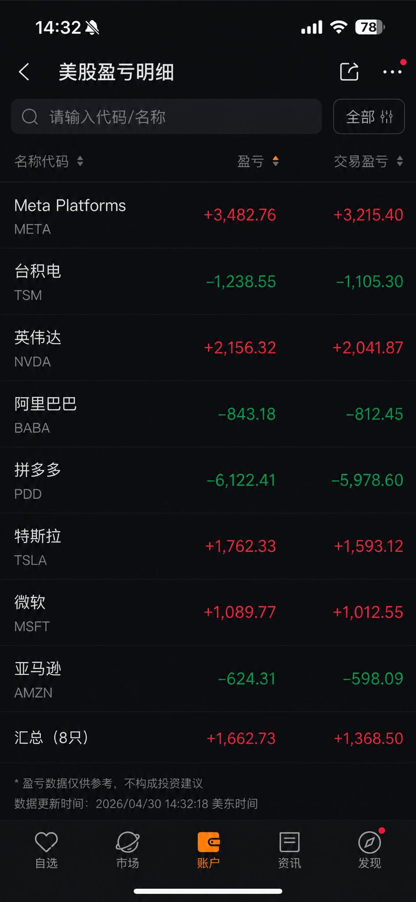
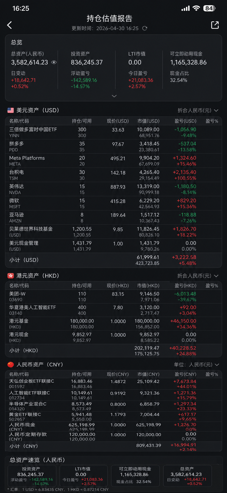

# stock-portfolio-valuation

Claude skill for portfolio valuation from a local CSV.

Portfolio valuation skill for Claude Code. It initializes holdings from natural language or screenshots, normalizes them into a local CSV, fetches market prices, and generates valuation, P&L, cash, and LTI summaries across USD, HKD, and CNY assets.
It also supports retirement-planning prompts such as `我什么时候可以不上班`, and can persist personal planning inputs into a local `profile.json`.

## Files

- `SKILL.md`: skill instructions and workflow
- `scripts/fetch_prices.py`: fetches prices and computes valuation JSON

## Init

First-time setup can start from natural language plus screenshots.

Typical ways to initialize:

- Send a message like `持仓` / `帮我初始化持仓`
- Paste stock or fund account screenshots
- Describe holdings in natural language, such as buy price, shares, fund market value, or cash balance

The skill will extract the information and normalize it into the local CSV.

If you want to initialize manually, only one required file is needed:

```bash
mkdir -p ~/Desktop/持仓
```

Create `~/Desktop/持仓/明细.csv` with:

```csv
account,category,name,code,market,currency,shares,cost_price,cost_total,last_market_value,last_pnl,last_updated,note
```

Common values:

- `account`: `富途` / `支付宝` / `腾讯理财通` / `LTI`
- `category`: `股票` / `基金` / `活期` / `存款` / `应收款` / `社保` / `加密货币`
- `market`: `US` / `HK` / `CN` / `FUND_USD` / `FUND_HKD` / `FUND_CNY`

Other files are optional and can be added later:

- `~/Desktop/持仓/总额.csv`
- `~/Desktop/持仓/已实现盈亏.csv`
- `~/Desktop/持仓/未来现金流.csv`
- `~/Desktop/持仓/profile.json`

## Retirement Profile

When you ask something like `我什么时候可以不上班`, the skill can save or reuse these profile fields:

- `birth_year_month`
- `years_worked`
- `annual_spending_cny`
- `annual_savings_cny`

Optional planning fields:

- `retirement_age`
- `lifespan_age`
- `current_social_security_personal_account_cny`
- `historical_contribution_multiple`
- `future_contribution_multiple`

You can let the skill save them from natural language, or update them manually with:

```bash
python3 scripts/profile_manager.py --birth-year-month YYYY-MM --years-worked N \
  --annual-spending-cny ANNUAL_SPENDING --annual-savings-cny ANNUAL_SAVINGS
python3 scripts/profile_manager.py --show
```

Typical natural-language inputs:

- `我是90后，出生年月是YYYY-MM`
- `我大概工作了十几年`
- `我每年大致消费几十万`
- `我每年能攒几十万`
- `我的社保个人账户现在大约有一笔余额`
- `之前按较高档位交，未来计划继续按更高档位交`

## Run

```bash
python3 scripts/init_portfolio.py
python3 scripts/init_portfolio.py --with-optional-files
python3 scripts/profile_manager.py --show
python3 scripts/retirement_projection.py
python3 scripts/retirement_projection.py --stop-age 46
python3 scripts/fetch_prices.py
python3 scripts/fetch_prices.py --fund-mode official
```

Notes:

- `FUND_CNY` funds prefer intraday estimated NAV, then fall back to official NAV.
- `FUND_HKD` and `FUND_USD` funds now try to fetch latest NAV from KGI fund-detail pages first.
- If an offshore fund cannot be resolved from the online source, the skill falls back to the local snapshot stored in `明细.csv`.

## Use

Typical prompts:

- `持仓`
- `帮我根据截图初始化持仓`
- `刷新持仓估值`
- `完整持仓估值报告`
- `累计盈亏`
- `可立即动用的现金有多少`
- `LTI 年初 vs 现在`
- `我什么时候可以不上班`
- `如果我在某个年龄不上班，退休时能领多少退休金`

Workflow:

1. Initialize from natural language or screenshots, or update `~/Desktop/持仓/明细.csv`
2. Run the script or ask for valuation in chat
3. Review holdings, P&L, cash, and LTI summaries

For retirement planning:

1. Save or update `~/Desktop/持仓/profile.json`
2. Keep `~/Desktop/持仓/总额.csv` and `~/Desktop/持仓/未来现金流.csv` updated
3. Run `scripts/retirement_projection.py` or ask in chat

## Retirement Countdown

Typical prompts:

- `距离退休还有多久？`
- `退休倒计时版`
- `什么时候可以不上班？`
- `距离不上班还差多少钱，预计还需要多久？`
- `做一个每年还差多少钱的倒计时表`

CLI usage:

```bash
python3 scripts/retirement_projection.py
python3 scripts/retirement_projection.py --stop-age TARGET_AGE
python3 scripts/retirement_projection.py --stop-month YYYY-MM
python3 scripts/retirement_projection.py --current-total-assets-cny CURRENT_TOTAL_ASSETS
```

What the output includes:

- `current_age_years`: your current age
- `current_total_assets_cny`: the asset base used in the calculation
- `bridge_assets_excluding_social_security_cny`: current assets excluding the social-security account used as future pension source
- `earliest_no_work_projection`: the earliest stop-working age that still keeps assets above zero through the target lifespan
- `earliest_no_work_month_projection`: the earliest stop-working month using monthly cash-flow simulation
- `nearby_month_scenarios`: boundary months around the earliest feasible month
- `scenario_table`: reference scenarios such as several stop-working ages and retirement age
- `annual_pension_cny`: estimated annual pension at retirement
- `monthly_pension_cny`: estimated monthly pension at retirement
- `projected_social_security_account_cny`: projected personal social-security account balance at retirement
- `yearly_projection`: yearly gap and ending assets after stopping work

Example summary in chat:

```text
最早大约在某个年龄可以不上班
距离不上班还差一段资产缺口
预计还需要若干年
退休后每年需要动用一部分存款
```

Example CLI output shape:

```json
{
  "current_date": "YYYY-MM-DD",
  "current_age_years": 30.0,
  "current_total_assets_cny": 3500000.0,
  "bridge_assets_excluding_social_security_cny": 3200000.0,
  "earliest_no_work_projection": {
    "stop_age": 50,
    "assets_at_stop_cny": 9000000.0,
    "ending_assets_cny": 500000.0,
    "annual_pension_cny": 150000.0
  },
  "earliest_no_work_month_projection": {
    "stop_month": "YYYY-MM",
    "stop_age": "50岁0个月",
    "months_until_stop": 120,
    "assets_at_stop_cny": 9000000.0,
    "ending_assets_cny": 500000.0,
    "monthly_pension_cny": 12500.0
  }
}
```

## Privacy

- This skill is designed for local personal finance workflows.
- Source data stays in local files such as `~/Desktop/持仓/明细.csv`.
- Example screenshots in this repository are privacy-obfuscated mockups, not real holdings data.
- The skill should normalize screenshot or natural-language inputs into local CSV files before valuation.
- Do not commit real portfolio CSV files, screenshots, or personal identifiers into a public repository.

## Examples

Privacy-obfuscated bookkeeping mockup:



Privacy-obfuscated valuation report mockup:


